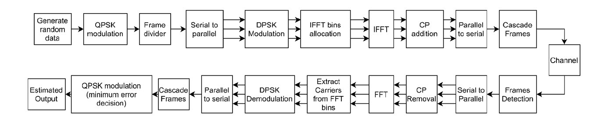

# Wireless-Communications
## 1. Narrowband Channel and Time Diversity
- Analyzed Bit Error Rate (BER) of BPSK in Rayleigh and AWGN channels
- Implemented Binary Pulse Position Modulation (BPPM)
- Implemented QPSK modulation
- Explored Time Diversity using Maximal Ratio Combining (MRC), including co-phasing

---

## 2. OFDM Implementation
- Transmitted \(10^7\) bits using QPSK modulation over AWGN channel
- Implemented OFDM modulation/demodulation including FFT/IFFT and cyclic prefix
- Evaluated system performance via BER analysis

